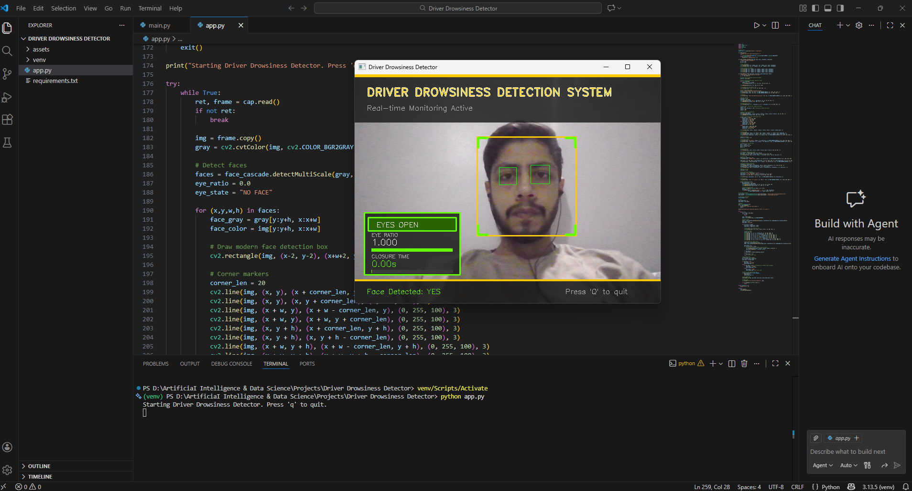

# 🚗 Driver Drowsiness Detection System


AI-powered drowsiness detection system that monitors driver alertness in real-time, triggering audio alarms when prolonged eye closure is detected to prevent accidents.

---

## ✨ Features

- **Real-time Face & Eye Detection** - Uses Haar Cascade classifiers for accurate detection
- **Eye Aspect Ratio Analysis** - Calculates eye openness to determine drowsiness
- **Closure Duration Tracking** - Monitors how long eyes remain closed
- **Audio Alert System** - Triggers alarm when drowsiness is detected (3+ seconds)
- **Modern Professional UI** - Clean, intuitive interface with real-time metrics
- **Visual Progress Indicators** - Color-coded status bars and warnings
- **Live Monitoring Dashboard** - Shows eye ratio, closure time, and detection status

---

## 🎬 Demo

### Normal Alertness (Eyes Open)

*Driver is alert - System shows green status with "EYES OPEN"*

### Drowsiness Detected (Eyes Closed)

*Drowsiness detected - System shows red alert with "EYES CLOSED" and triggers alarm*

---

## 🛠️ Installation

### Prerequisites
- Python 3.8 or higher
- Webcam/Camera
- Windows OS (for `winsound` module)

### Step 1: Clone the Repository
```bash
git clone https://github.com/adeel-iqbal/driver-drowsiness-detector.git
cd driver-drowsiness-detector
```

### Step 2: Install Dependencies
```bash
pip install -r requirements.txt
```

### Step 3: Verify Assets
Ensure the `assets/` folder contains:
- `alarm.wav` - Audio alert file

---

## 🚀 Usage

### Run the Application
```bash
python app.py
```

### Controls
- **Q** - Quit the application
- The system will automatically start monitoring once your face is detected

### What Happens?
1. Camera feed opens with real-time face detection
2. System tracks your eyes and calculates Eye Aspect Ratio
3. If eyes remain closed for **3+ seconds**, an alarm sounds
4. Visual alerts appear on screen with red warning overlay

---

## 🧠 How It Works

### Detection Pipeline

1. **Frame Capture** - Captures video frames from webcam
2. **Face Detection** - Uses Haar Cascade to detect face region
3. **Eye Region Extraction** - Focuses on upper half of detected face
4. **Eye Detection** - Detects individual eyes using Haar Cascade
5. **Aspect Ratio Calculation** - Computes eye height/width ratio
6. **State Determination** - Classifies eyes as OPEN or CLOSED based on threshold (0.15)
7. **Duration Tracking** - Monitors closure duration in real-time
8. **Alert Triggering** - Sounds alarm if eyes closed ≥ 3 seconds

### Algorithm

```
Eye Aspect Ratio (EAR) = Eye Height / Eye Width

if EAR < 0.15:
    State = "CLOSED"
    Duration += dt
    if Duration >= 3.0 seconds:
        TRIGGER ALARM
else:
    State = "OPEN"
    Duration = 0
```

---

## 📁 Project Structure

```
driver-drowsiness-detector/
│
├── app.py                  # Main application file
├── requirements.txt        # Python dependencies
├── README.md              # Project documentation
│
└── assets/
    ├── alarm.wav          # Audio alert file
    ├── preview1.png       # Screenshot - Eyes Open
    └── preview2.png       # Screenshot - Eyes Closed
```

---

## ⚙️ Configuration

### Adjustable Parameters (in `app.py`)

```python
# Alert threshold - Time before alarm triggers
ALERT_SECONDS = 3.0  # Default: 3 seconds

# Eye closure threshold - Lower = more sensitive
EYE_RATIO_THRESHOLD = 0.15  # Default: 0.15

# Face detection parameters
scaleFactor = 1.05      # Face detection sensitivity
minNeighbors = 5        # Detection accuracy
minSize = (80, 80)      # Minimum face size

# Eye detection parameters
eye_scaleFactor = 1.05  # Eye detection sensitivity
eye_minNeighbors = 4    # Detection accuracy
eye_minSize = (15, 10)  # Minimum eye size
```

### Customization Tips
- **Increase `ALERT_SECONDS`** for longer tolerance before alarm
- **Adjust `EYE_RATIO_THRESHOLD`** based on your eye shape and camera angle
- **Modify `minNeighbors`** to reduce false detections (higher = stricter)

---

## 🔧 Technologies Used

| Technology | Purpose |
|------------|---------|
| **Python 3.8+** | Core programming language |
| **OpenCV (cv2)** | Computer vision and image processing |
| **NumPy** | Numerical computations |
| **Haar Cascades** | Face and eye detection classifiers |
| **Winsound** | Audio alert system (Windows) |

---

## 🤝 Contributing

Contributions are welcome! Here's how you can help:

1. **Fork** the repository
2. Create a **feature branch** (`git checkout -b feature/AmazingFeature`)
3. **Commit** your changes (`git commit -m 'Add some AmazingFeature'`)
4. **Push** to the branch (`git push origin feature/AmazingFeature`)
5. Open a **Pull Request**

### Ideas for Contribution
- Add support for Linux/Mac (replace `winsound`)
- Implement mouth yawn detection
- Add head pose estimation
- Create a web-based version
- Improve detection accuracy with deep learning models

---

## 📧 Contact

**Adeel Iqbal Memon**

- 📧 Email: [adeelmemon096@yahoo.com](mailto:adeelmemon096@yahoo.com)
- 💼 LinkedIn: [linkedin.com/in/adeeliqbalmemon](https://linkedin.com/in/adeeliqbalmemon)
- 🐙 GitHub: [@adeel-iqbal](https://github.com/adeel-iqbal)

---

## 🌟 Acknowledgments

- OpenCV team for the amazing computer vision library
- Haar Cascade classifiers from OpenCV's pre-trained models
- Inspiration from real-world drowsy driving prevention systems

---

## ⚠️ Disclaimer

This system is designed as an **assistive technology** and should not be solely relied upon for driver safety. Always prioritize:
- Getting adequate rest before driving
- Taking regular breaks on long journeys
- Professional medical advice for persistent fatigue

**Stay Safe. Drive Alert.** 🚗💨

---

<div align="center">

### If you find this project helpful, please consider giving it a ⭐!

Made with ❤️ by Adeel Iqbal Memon

</div>
